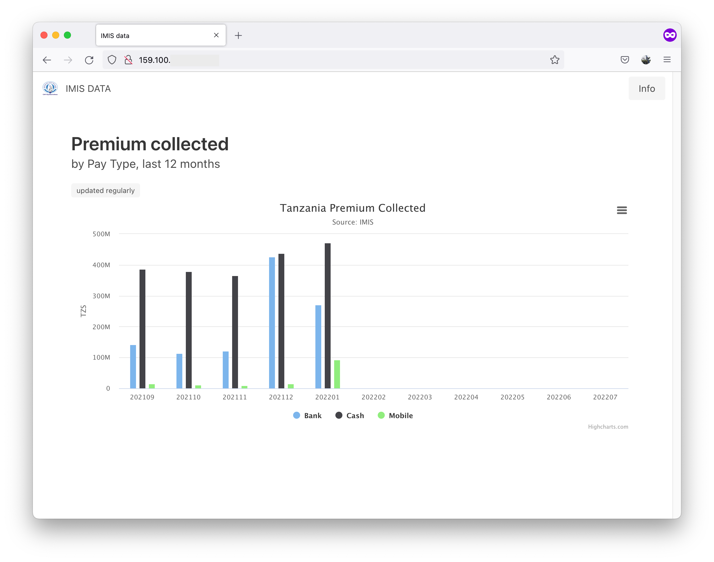

# DHIS2-IMIS-ETL-Portal

> IMIS public data portal using Python, Flask, Jinja templates, Bulma CSS, Docker, and Highcharts.



## Installation

* Install on a VM running Ubuntu 20.04 (512MB RAM, 1CPU, 10GB is fine)
* Make sure only Web Ports are open (SSH, HTTP, HTTPS)
* On VM, install [Docker](https://docs.docker.com/engine/install/ubuntu/)

```
ssh <YOUR.IP.ADDRESS>
git clone <this-repo>
cd <this-repo>
```

then set up permissions and test with hello-world

```
sudo groupadd docker
sudo usermod -aG docker $USER
newgrp docker
docker run hello-world
```

then create and fill out a .env file

```
DHIS2BASEURL=
DHIS2USERNAME=
DHIS2PASSWORD=
```
and `chmod 0600 .env` to restrict access

> **Warning**
> Keep the `.env` file in a secure location

build the image and run it

```
docker image build -t imis_portal . 
docker run -it -p 80:80 -d imis_portal
```

This will automatically read the `.env` file, start the container, and returns a container hash, e.g. `1efc3c3523dc12...`.

To watch logs:

```
docker logs <containerhash> -f
```

... then you should see the website running at `http://YOUR.IP.ADDRESS` (or at `http://yourwebsite.com`)

## Development

Requirements: Docker, Python 3

Create .env file

```
DHIS2BASEURL=
DHIS2USERNAME=
DHIS2PASSWORD=
```

Install and run:

```
python3 -m virtualenv .venv
source .venv/bin/activate
pip install -r requirements.txt
python main.py
```

To download data:

```
python background.py
```

### Adding more charts

1. Create a new chart in DHIS2
2. Make sure the user `DHIS2USERNAME` has access to the chart
3. Identify the /api/analytics DHIS2 API request used to fetch data for that chart
4. Add it to `charts` in `background.py`
5. Find an equivalent visualization at [highcharts.com](https://www.highcharts.com/demo)
6. Add it to the `templates`, e.g. in `index.html` and possibly custom CSS into the `static` folder
7. Make it dynamic by parsing the data downloaded via `background.py` into the `data` folder and pass it to the template.
