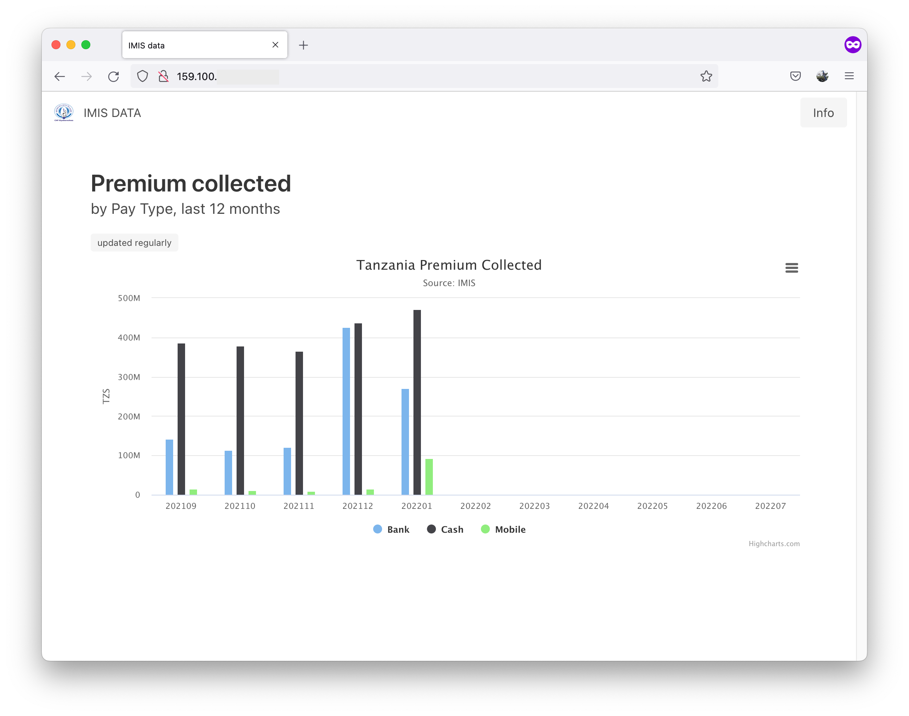

# DHIS2-IMIS-ETL-Portal



## Installation

* Install on a small VM running Ubuntu 20.04
* On VM, install [Docker](https://docs.docker.com/engine/install/ubuntu/)

```
git clone <this-repo>
cd <this-repo>
```

then set up permissions

```
sudo groupadd docker
sudo usermod -aG docker $USER
newgrp docker
docker run hello-world
```

build the image and run it

```
docker image build -t flask_docker . 
docker run -it -p 80:5000 -d flask_docker
```

watch logs

```
docker logs <containerhash> -f
```

then you should see the website running at `http://YOUR.IP.ADDRESS:80` (or at `http://yourwebsite.com`)