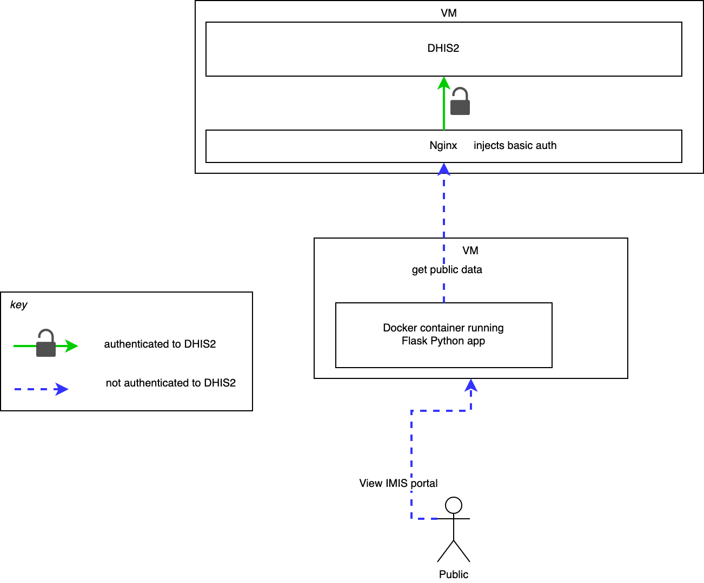

# DHIS2-IMIS-ETL-Portal


## Installation

* Install on a VM running Ubuntu 20.04 (512MB RAM, 1CPU, 10GB is fine)
* Make sure only Web Ports are open (SSH, HTTP, HTTPS)
* On VM, install [Docker](https://docs.docker.com/engine/install/ubuntu/)

```
ssh <YOUR.IP.ADDRESS>
git clone <this-repo>
cd <this-repo>
```

then set up permissions and test with hello-world

```
sudo groupadd docker
sudo usermod -aG docker $USER
newgrp docker
docker run hello-world
```

build the image and run it

```
docker image build -t imis_portal . 
docker run -it -p 80:80 -d -e DHIS2BASEURL=https://dhis2.instance.org imis_portal
```

`--e DHIS2BASEURL=` is for defining the DHIS2 instance to pull data.

watch logs

```
docker logs <containerhash> -f
```

... then you should see the website running at `http://YOUR.IP.ADDRESS` (or at `http://yourwebsite.com`)

## Development

Requirements: Docker, Python

Create .env file

```
DHIS2BASEURL=
```

Install and run in dev mode

```
python3 -m virtualenv .venv
source .venv/bin/activate
pip install -r requirements.txt
python main.py
```

To download data:

```
python background.py
```

## Architecture

To configure Nginx, see [docs](docs/nginx_configuration.md).


